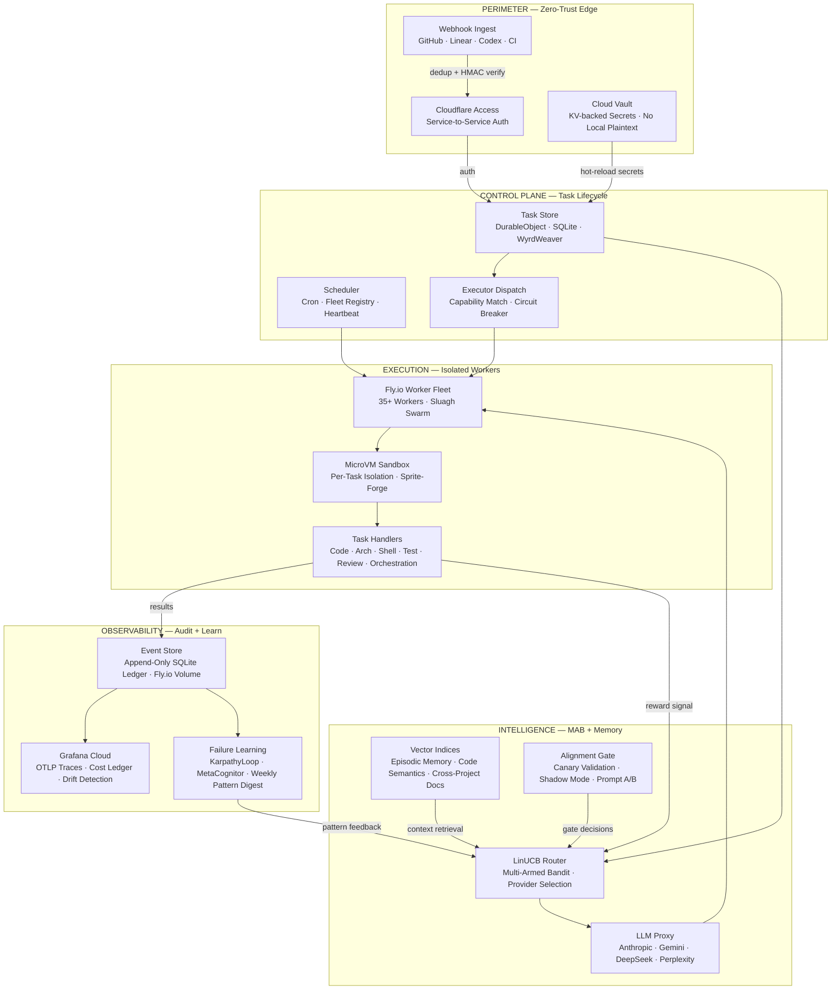

# Rift Root LLC

**Building Erebus Edge** — sovereign AI execution infrastructure for hostile networks.  
Agentic-first. MAB-optimized. Bootstrapped from Northern Colorado.

---

## The Problem

Most AI tooling assumes unconstrained outbound access to provider APIs.

That assumption breaks inside firewalled enterprise networks, air-gapped environments, and corporate-controlled infrastructure where outbound calls to Anthropic, Google, or any external AI endpoint are blocked, logged, or simply impossible. Teams in those environments either run no AI tooling at all, or they route sensitive workloads through consumer-grade wrappers that were never built for that constraint.

Erebus Edge is built for exactly that condition.

---

## How It Operates Inside a Hostile Network

- **Keys never cross the perimeter.** All provider credentials live in a KV-backed cloud vault. No local plaintext. No secrets in env files, dotfiles, or CI variables visible to corporate tooling.
- **Webhook-in, nothing-out.** The only traffic that crosses the network boundary is inbound webhook ingest (GitHub, Linear, CI). The execution plane pulls work; it does not push secrets outward.
- **Zero-trust auth on every surface.** Cloudflare Access gates all admin and service-to-service traffic. Internal routing via Flycast never touches the public internet.
- **Bootstrap-of-bootstrap posture.** The only secret a machine needs to start is a single CF Workers token stored in the OS keychain. Everything else hydrates from the vault at runtime.
- **Hot-reload without restart.** Secrets rotate in the KV vault and propagate to running workers without a redeploy cycle, which matters in environments where deployment windows are controlled.

---

## Architecture

---

## What Is Inside

| Layer | Key Components | Scale |
|---|---|---|
| Perimeter | CF Access, KV Vault, webhook HMAC, Flycast routing | 4 webhook receivers |
| Control Plane | WyrdWeaver DO, task store API, fleet registry, cron scheduler | ~60 HTTP endpoints |
| Intelligence | LinUCB MAB router, LLM proxy, 3 Vectorize indices, alignment gate, prompt evolution | 4 providers, 3 vector spaces |
| Execution | Fly.io worker fleet, Sprite-Forge microVM sandbox, 11 task handler types | 35+ workers, per-task VM isolation |
| Observability | Append-only event store, Grafana OTLP, drift detection, cost ledger, failure learning | 15 cron schedules, weekly digests |

**Total surface:** ~100 exposed HTTP endpoints (557 routes in the control plane router), 6+ DurableObjects, 12+ service bindings, 40+ CLI scripts and tooling subdirectories.

---

## Status

Active development. Erebus Edge is the production infrastructure backing Rift Root consulting engagements.

---

> [riftroot.com](https://riftroot.com) · Fort Collins, Colorado
